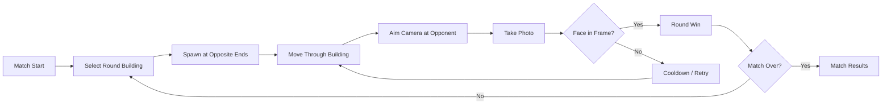
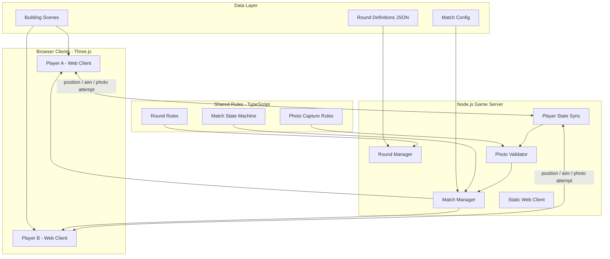
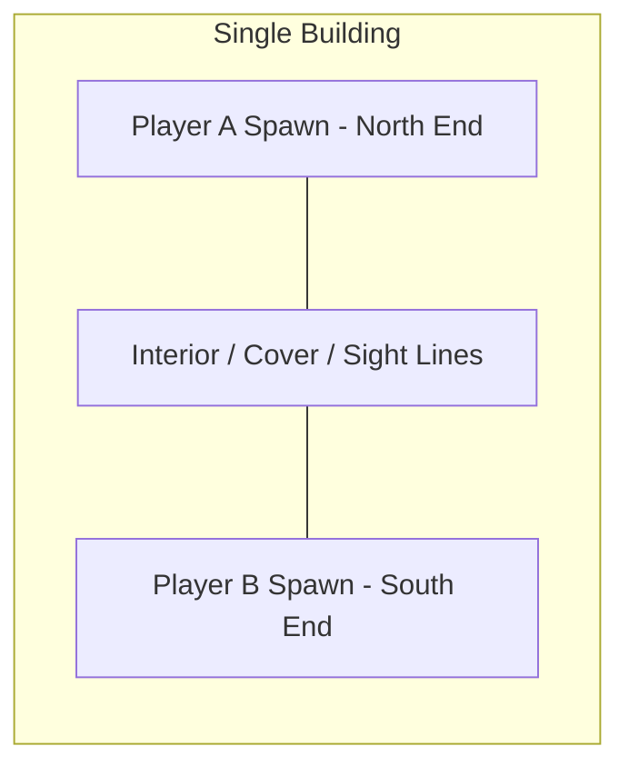
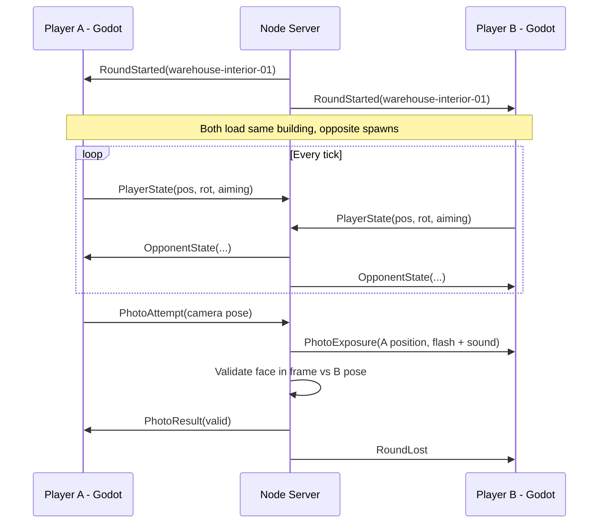

# PhotoSnipe Architecture

## Vision

PhotoSnipe is a **1v1 competitive first-person game**. Two players begin each round at **opposite ends of the same building** and move through it trying to line up a shot on their opponent. The first player to land a **valid photograph** — with the opponent's **face in frame** — wins the round.

Each round uses a **different building**, so floor plans, cover, and sight lines change throughout a match. The core tension is positioning and timing: find a sight line on your opponent without giving them one on you.

**Primary client:** Browser (TypeScript + Three.js) in `client/web/`. Legacy Godot 4 desktop client in `client/godot/` (warehouse only). See [ENGINE.md](ENGINE.md) for the original engine decision rationale.

---

## Core Gameplay Loop



### Player actions (first-person)

| Action | Description |
|---|---|
| Move | **Slow tactical walk** through the building (no sprint in MVP) |
| Look | Mouse / stick camera control |
| Aim camera | Raise viewfinder; narrows FOV, slows movement, enables capture |
| Take photo | Attempt to capture the opponent's face in frame |

### Movement (MVP defaults)

Tactical slow walk for the first playtest. Values are tunable in [`data/config/game-defaults.json`](../data/config/game-defaults.json).

| Parameter | Default | Notes |
|---|---|---|
| `walkSpeedMps` | `3.0` | ~6.7 mph; slower than typical FPS run speed |
| `aimModeSpeedMultiplier` | `0.6` | Movement while aiming camera (~1.8 m/s) |
| Sprint | disabled | Post-MVP; tune after first online playtest |

### Win / loss conditions

- **Round win**: First player to land a **valid photograph** with the opponent's face in frame.
- **Round draw** (optional): Timer expires with no valid photo.
- **Match win**: First to `N` round wins (e.g., best of 3).

---

## Architectural Principles

1. **Server-authoritative captures.** The server decides whether a photo is valid. Clients never self-report wins.
2. **Rounds are data.** Building scene, opposite-end spawn points, and rules live in JSON.
3. **One building, two spawns.** Both players share the same geometry and collision; they start at opposite ends and converge.
4. **Face-specific validation.** A valid photo requires the opponent's **face hit volume** inside the camera frustum — body-only shots do not count.
5. **Separate simulation from presentation.** Movement and rendering are client-side (web/Godot); match outcome logic is shared and server-verified (TypeScript).
6. **Web client for production; Node for server.** Browser Three.js client is the shipped product; server handles fairness.

---

## System Overview



---

## Module Boundaries

### Shared rules (`core/`)

Engine-neutral TypeScript. No Godot dependencies.

| Module | Responsibility |
|---|---|
| `MatchStateMachine` | Lobby → round start → round end → match end |
| `RoundManager` | Load round config, assign spawns, track round timer |
| `PhotoCaptureRules` | Distance, FOV, face-in-frame, occlusion policy |
| `PhotoValidator` | Given poses + camera params, return valid/invalid + reason |
| `PlayerState` | Position, rotation, aim mode, last photo attempt timestamp |
| `Events` | `RoundStarted`, `PhotoAttempted`, `RoundWon`, `MatchWon` |

### Game server (`server/`)

| Module | Responsibility |
|---|---|
| `LobbyManager` | Room codes, pair two online players, start match |
| `SessionManager` | Host match, accept two players, handle disconnects |
| `StateSync` | Receive client poses; broadcast opponent state at tick rate |
| `PhotoValidator` | Run capture checks on photo attempts |
| `RoundOrchestrator` | Rotate buildings between rounds, reset spawns |
| `Anti-cheat hooks` | Rate-limit photos, sanity-check movement (post-MVP) |

### Web client (`client/web/`) — primary

| Module | Responsibility |
|---|---|
| `game/` | Three.js scene, FPS movement, arena loading, match HUD |
| `net/client.ts` | WebSocket connection and message dispatch |
| `practice/` | Offline bot matches (client-only) |
| `shop/` | Credits economy, skins, arena host passes |
| `progression/` | Ladder rank, arena unlocks, match stats |
| `social/` | Friends list, presence, room invites |
| `replay/` | Kill-cam playback |

### Godot client (`client/godot/`) — legacy

| Module | Responsibility |
|---|---|
| `FPSController` | `CharacterBody3D` movement, look, building collision |
| `CameraController` | Viewfinder mode, FOV change, capture input |
| `BuildingLoader` | Load round building scene from round definition |
| `Avatar` | Player model with attached **face hit volume** marker |
| `NetClient` | `WebSocketPeer` to server; send state, receive events |
| `HUD` | Round timer (5 min), photo cooldown, win/loss feedback |
| `ExposureFX` | Flash VFX + shutter sound on capture; play opponent exposure cues |
| `ResultsView` | Show captured photo frame on round end |

### Data (`data/`)

| Asset | Format | Notes |
|---|---|---|
| Rounds | JSON | One building, two spawns, rules |
| Buildings | GLB / Godot scene | Single interior per round |
| Match config | JSON | Round pool, rounds to win |
| Schemas | JSON Schema | CI validation |

---

## Round & Building Model

Each **round** loads **one building**. Both players spawn at **opposite ends** of that building and move freely through the same space.



### Round definition

See [`schemas/round.schema.json`](schemas/round.schema.json).

```json
{
  "id": "warehouse-interior-01",
  "name": "Warehouse Interior",
  "building": {
    "id": "warehouse-main",
    "scene": "data/buildings/warehouse-main.glb"
  },
  "spawns": {
    "playerA": {
      "position": [2.0, 0.0, -24.0],
      "rotation": [0, 0, 0]
    },
    "playerB": {
      "position": [2.0, 0.0, 24.0],
      "rotation": [0, 180, 0]
    }
  },
  "rules": {
    "roundTimeLimitSec": 300,
    "photoCooldownSec": 2.0,
    "maxPhotoDistance": 60.0,
    "minPhotoDistance": 3.0,
    "requireAimMode": true,
    "requireFaceInFrame": true,
    "exposure": {
      "flash": true,
      "sound": true,
      "soundAudibleRadius": 25.0,
      "flashVisibleRadius": 40.0,
      "flashDurationSec": 0.15
    }
  }
}
```

### Round rotation

A **match** references a pool of rounds. Each round is a different building. After each round, the next building loads.

```json
{
  "roundPool": ["warehouse-interior-01", "office-tower-01", "parking-garage-01"],
  "roundsToWin": 2
}
```

---

## Photo Capture — The Core Mechanic

Taking a photo is the win condition. A shot counts only when the opponent's **face** is visible in the viewfinder.

### Capture flow

1. Player enters **aim mode** (raises camera / viewfinder).
2. Player aligns the opponent's face toward the reticle.
3. Player presses **capture**.
4. Client sends a `PhotoAttempt` event with timestamp, camera pose, and FOV.
5. Server immediately broadcasts **photo exposure** to the opponent — flash + shutter sound at the shooter's position (see below).
6. Server runs validation against the **authoritative opponent pose** at that tick.
7. Server broadcasts result: `valid_capture` (round over) or `invalid_capture` (cooldown).

Every capture attempt exposes the shooter, whether the photo is valid or not. Missing a shot still gives away your position.

### Validation rules (MVP)

A photo is **valid** when all conditions pass:

| Rule | Description |
|---|---|
| Face in frame | Opponent's **face hit volume** projects fully inside camera frustum |
| Distance | Opponent within `minPhotoDistance`–`maxPhotoDistance` |
| Line of sight | Ray from camera to face center not blocked by geometry |
| Aim mode | Player was in aim mode if `requireAimMode` is true |
| Cooldown | Previous attempt by this player was > `photoCooldownSec` ago |

Body or torso visibility alone is **not** sufficient. Partial face visibility (at least the full face volume) **is** sufficient.

### Face hit volume

Each player avatar carries a defined **face volume** — a small box or sphere centered on the head/face area. The server validates against this volume, not the full body capsule.

```
Body capsule  → used for movement collision only
Face volume   → used for photo win validation
```

In Godot, attach the face volume as a named node on the avatar (e.g., `FaceHitVolume` at head height). The server stores face offset relative to the player's root position and heading.

```typescript
interface PhotoAttempt {
  playerId: string;
  timestampMs: number;
  cameraPosition: Vector3;
  cameraRotation: Quaternion;
  fovDeg: number;
}

interface OpponentPose {
  position: Vector3;
  rotation: Quaternion;
  faceOffset: Vector3;   // local offset from root to face center
  faceRadius: number;    // sphere radius for validation
}

interface PhotoValidationResult {
  valid: boolean;
  reason?:
    | "face_out_of_frame"
    | "too_far"
    | "too_close"
    | "face_occluded"
    | "cooldown"
    | "not_aiming";
}
```

### Face-in-frame algorithm

1. Compute world-space face center from opponent pose + `faceOffset`.
2. Project face center into shooter's camera space; check inside frustum.
3. Check all face volume sample points (center + radius offsets) are inside frustum.
4. Raycast from camera to face center; fail if geometry blocks.

### Photo exposure (flash + sound)

Taking a photo is risky. Each attempt triggers audible and visible exposure at the shooter's location.

| Effect | Behavior |
|---|---|
| **Flash** | Brief light burst at shooter position; opponent sees it if they have line of sight within `flashVisibleRadius` |
| **Shutter sound** | 3D positional audio; opponent hears it if within `soundAudibleRadius` of shooter |

The server sends a `PhotoExposure` event to the opponent **before** validation completes, so a miss still reveals the shooter's approximate position. This creates a core tradeoff: shoot early and risk giving away your location, or wait for a clearer face shot.

```typescript
interface PhotoExposureEvent {
  shooterId: string;
  position: Vector3;
  timestampMs: number;
  flash: boolean;
  sound: boolean;
}
```

Godot client responsibilities:

- Play local flash VFX on capture (brief screen flash + point light at player)
- Play shutter sound locally and at shooter's world position for the opponent
- Opponent uses exposure cue to triangulate and push toward the shooter

### Round duration

Each round lasts **5 minutes** (`roundTimeLimitSec: 300`). If no valid photo is taken before time expires, the round ends in a **draw** (no round win awarded; match continues to next building).

---

## Networking Model

### Authoritative dedicated server (Node.js + WebSocket)

| Concern | Approach |
|---|---|
| Transport | WebSocket (Godot `WebSocketPeer` ↔ Node `ws`) |
| Tick rate | 20 Hz state broadcast for opponent pose |
| Photo attempts | Reliable event to server; server responds with result |
| Building load | Server sends `roundId`; both Godot clients load the same building |



### Online from day one

MVP targets **real online 1v1 play** over the internet, not local-only or split-screen testing.

| Concern | MVP approach |
|---|---|
| Server hosting | Deployed Node.js server with a public WebSocket endpoint |
| Matchmaking | Simple lobby: create room code → opponent joins → match starts |
| Connections | Godot clients connect to `wss://` server URL; no peer-to-peer |
| Latency | 20 Hz pose sync; photo attempts are timestamped server-side |
| Disconnects | Forfeit after timeout if a player drops mid-round |

Local development still runs the same server binary against `localhost`, but the architecture and MVP acceptance criteria assume **two remote clients** connecting through the deployed endpoint.

---

## Platform Strategy

| Component | Choice | Notes |
|---|---|---|
| MVP client | **Godot 4** | FPS movement, building scenes, WebSocket client |
| Server | **Node.js + TypeScript** | Shared `core/` rules, photo validation |
| Phase 2 browser | Godot web export | Same client, WASM build |
| Phase 3 Unity port | Optional | Reuse round JSON + server protocol |

See [ENGINE.md](ENGINE.md) for Godot vs Unity reasoning.

### What transfers across engines

- Round JSON and JSON Schema
- Match rules and photo validation logic (TypeScript `core/`)
- Network event protocol
- GLB building assets

### What is Godot-specific (MVP)

- FPS controller and collision
- Building scene setup and lighting
- Avatar + face hit volume node
- Camera / viewfinder presentation
- WebSocket client glue

---

## Proposed Repository Structure

```
photo-snipe/
├── core/                   # Shared match rules (TypeScript)
│   ├── match/
│   ├── round/
│   ├── photo-validation/
│   └── events/
├── server/                 # Node.js authoritative server
├── client/
│   └── godot/              # Godot 4 project
├── data/
│   ├── rounds/             # Round JSON (one building, two spawns)
│   ├── matches/            # Match config (round pools)
│   └── buildings/          # GLB / Godot scenes
├── docs/
│   ├── ARCHITECTURE.md
│   ├── ENGINE.md
│   ├── NETWORKING.md       # Wire protocol
│   └── schemas/
└── scripts/                # Schema validation, round authoring helpers
```

---

## Shipped Scope (Final)

### Implemented

- [x] **Browser web client** with first-person walk, look, jump, and aim mode
- [x] **Online 1v1** over deployed WebSocket server (`wss://`)
- [x] Room-code lobby (create/join match) with host arena selection
- [x] **7 arenas** with distinct layouts and occlusion geometry
- [x] Aim mode + photo capture with exposure flash/sound
- [x] Server-validated **body-in-frame** win condition with line-of-sight occlusion
- [x] **5-minute round timer** with draw on timeout
- [x] Round win screen, best-of-N match flow, rematch voting
- [x] **Ranked operator ladder** (12 ranks, localStorage persistence)
- [x] **Credits & shop** (skins, arena host passes)
- [x] **Social** (friends, presence, invites)
- [x] **Solo practice vs bot** (easy/medium/hard)
- [x] **Kill-cam replay** on valid captures
- [x] Unit tests for validation, ladder, arenas (64 tests)

### Out of scope

- Account system / cross-device progression sync
- Skill-based matchmaking (room codes only)
- More than 2 players per match
- Procedural buildings
- Mobile builds

See also [TECHNICAL_WALKTHROUGH.md](TECHNICAL_WALKTHROUGH.md), [STRESS_TEST.md](STRESS_TEST.md), and [DEMO_SCRIPT.md](DEMO_SCRIPT.md).

---

## Testing Strategy

| Layer | Approach |
|---|---|
| Face validation | Unit tests: face in/out of frame, occluded, too far |
| Round rotation | Unit tests for match state machine |
| Server events | Integration tests with mock WebSocket clients |
| Godot client | Online playtest with two remote clients via deployed server |
| Data | JSON Schema validation for all round files |

---

## Resolved Decisions

| Decision | Choice |
|---|---|
| Engine | **Godot 4** (see [ENGINE.md](ENGINE.md)) |
| Building topology | **One building** per round; players at opposite ends |
| Capture strictness | **Face must be in frame**; body alone does not count |
| Photo exposure | **Flash + shutter sound** on every capture attempt |
| Round duration | **5 minutes** per round; draw if timer expires |
| Networking | **Online from day one** — deployed server, room-code lobby |
| Movement | **Slow tactical walk** (3.0 m/s); tune after first playtest |

---

## Next Steps

1. Re-record the demo video using [DEMO_SCRIPT.md](DEMO_SCRIPT.md) — two-browser multiplayer, technical walkthrough, AI reflection.
2. Optional: expand Godot client to feature-parity with web (7 arenas).
3. Optional: add account system for cross-device progression.
