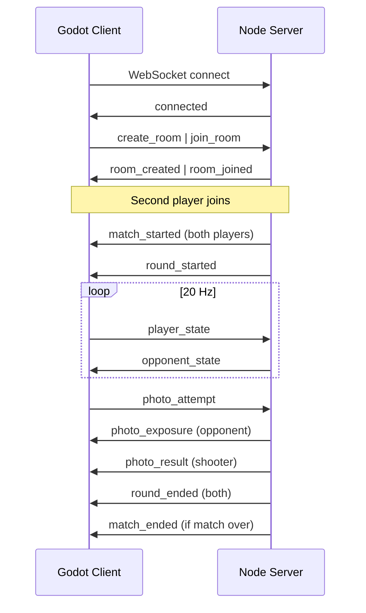

# PhotoSnipe Networking Protocol

WebSocket-based protocol between Godot clients and the Node.js authoritative server. All messages are **JSON** with a `type` field.

**Transport:** `ws://` (dev) or `wss://` (production)  
**Default port:** `8787`  
**State sync rate:** 20 Hz (50 ms)  
**Encoding:** UTF-8 JSON, one message per frame

---

## Connection lifecycle



---

## Client → Server messages

### `create_room`

Host a new match. Server assigns a room code and player slot `A`.

```json
{
  "type": "create_room",
  "displayName": "PlayerOne"
}
```

### `join_room`

Join an existing room by code. Assigned slot `B`.

```json
{
  "type": "join_room",
  "roomCode": "ABCD",
  "displayName": "PlayerTwo"
}
```

### `player_state`

Sent at **20 Hz** while a round is active.

```json
{
  "type": "player_state",
  "position": [2.0, 0.0, -24.0],
  "rotation": [0, 45.0, 0],
  "aiming": false,
  "sequence": 1042
}
```

| Field | Type | Notes |
|---|---|---|
| `position` | `[x, y, z]` | World meters |
| `rotation` | `[x, y, z]` | Euler degrees |
| `aiming` | boolean | In camera aim mode |
| `sequence` | number | Client monotonic counter; server uses latest |

### `photo_attempt`

Reliable capture attempt. Server timestamps on receipt.

```json
{
  "type": "photo_attempt",
  "cameraPosition": [5.0, 1.6, -10.0],
  "cameraRotation": [0, 90.0, 0],
  "fovDeg": 40.0,
  "aiming": true
}
```

---

## Server → Client messages

### `connected`

```json
{
  "type": "connected",
  "clientId": "uuid",
  "serverTimeMs": 1710000000000
}
```

### `room_created`

```json
{
  "type": "room_created",
  "roomCode": "ABCD",
  "playerSlot": "A"
}
```

### `room_joined`

```json
{
  "type": "room_joined",
  "roomCode": "ABCD",
  "playerSlot": "B"
}
```

### `match_started`

Sent to both players when the room is full.

```json
{
  "type": "match_started",
  "matchId": "uuid",
  "playerSlot": "A",
  "opponentName": "PlayerTwo",
  "matchConfig": {
    "roundsToWin": 2,
    "roundPool": ["warehouse-interior-01"]
  }
}
```

### `round_started`

```json
{
  "type": "round_started",
  "roundIndex": 0,
  "round": {
    "id": "warehouse-interior-01",
    "name": "Warehouse Interior",
    "building": { "id": "warehouse-main", "scene": "data/buildings/warehouse-main.glb" },
    "spawns": {
      "playerA": { "position": [2.0, 0.0, -24.0], "rotation": [0, 0, 0] },
      "playerB": { "position": [2.0, 0.0, 24.0], "rotation": [0, 180, 0] }
    },
    "rules": { "roundTimeLimitSec": 300, "...": "..." }
  },
  "yourSpawn": { "position": [2.0, 0.0, -24.0], "rotation": [0, 0, 0] },
  "roundEndsAtMs": 1710000300000
}
```

### `opponent_state`

Broadcast at 20 Hz to each client.

```json
{
  "type": "opponent_state",
  "position": [2.0, 0.0, 24.0],
  "rotation": [0, 180.0, 0],
  "aiming": false,
  "serverTimeMs": 1710000000050
}
```

### `photo_exposure`

Sent to the **opponent** immediately when a photo is attempted (before validation).

```json
{
  "type": "photo_exposure",
  "shooterSlot": "A",
  "position": [5.0, 1.6, -10.0],
  "timestampMs": 1710000001000,
  "flash": true,
  "sound": true,
  "soundAudibleRadius": 25.0,
  "flashVisibleRadius": 40.0,
  "flashDurationSec": 0.15
}
```

### `photo_result`

Sent to the **shooter** after validation.

```json
{
  "type": "photo_result",
  "valid": false,
  "reason": "face_out_of_frame"
}
```

Reasons: `face_out_of_frame`, `too_far`, `too_close`, `cooldown`, `not_aiming`

### `round_ended`

```json
{
  "type": "round_ended",
  "reason": "valid_capture",
  "winnerSlot": "A",
  "scores": { "A": 1, "B": 0 }
}
```

Reasons: `valid_capture`, `timeout_draw`, `forfeit`

### `match_ended`

```json
{
  "type": "match_ended",
  "winnerSlot": "A",
  "scores": { "A": 2, "B": 0 }
}
```

### `error`

```json
{
  "type": "error",
  "code": "room_not_found",
  "message": "No room with that code exists"
}
```

Error codes: `room_not_found`, `room_full`, `invalid_message`, `not_in_match`, `match_in_progress`

---

## Timing and authority

| Data | Authority |
|---|---|
| Player movement | Client predicts locally; server relays to opponent |
| Photo validity | **Server only** |
| Round / match outcome | **Server only** |
| Round timer | Server `roundEndsAtMs`; client displays countdown |

Photo validation uses the **opponent's last authoritative `player_state`** at attempt time. Occlusion is skipped in MVP (no building mesh on server).

---

## Godot client integration

| Script | Responsibility |
|---|---|
| `net_client.gd` | WebSocket connect, parse/send JSON |
| `game_manager.gd` | Route server events to gameplay |
| `fps_controller.gd` | Emit `player_state` at 20 Hz |
| `camera_controller.gd` | Send `photo_attempt` on capture |
| `exposure_fx.gd` | React to `photo_exposure` |
| `lobby.gd` | `create_room` / `join_room` UI |

Default server URL is configurable in `client/godot/config/network.cfg`:

```
server_url=ws://localhost:8787
```

---

## Development

```bash
# Terminal 1 — server
npm run dev -w server

# Terminal 2+ — Godot clients (two instances)
# Open client/godot, run main scene, create/join room
```

Production deploy exposes `wss://your-host:8787` behind TLS termination (nginx, Fly.io, Railway, etc.).
