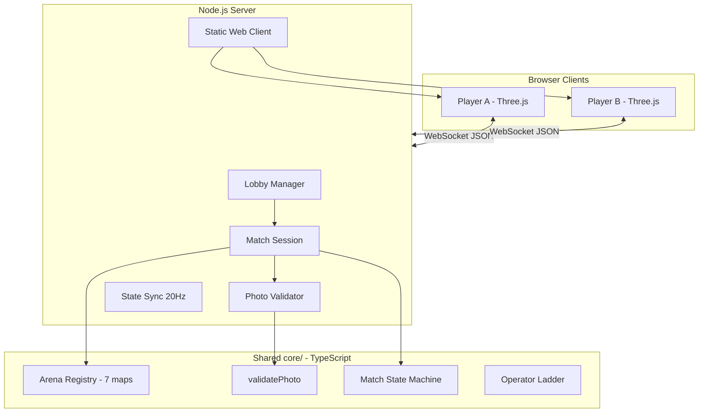
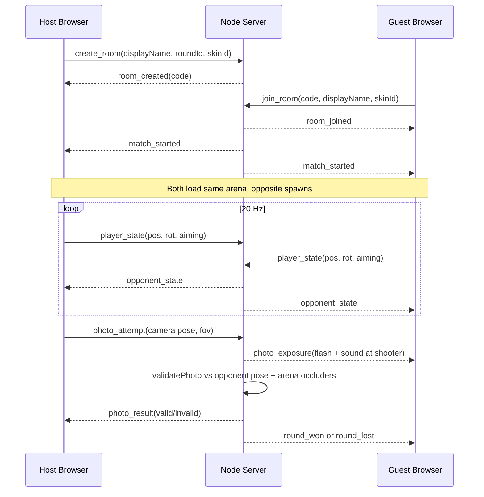

# PhotoSnipe Technical Walkthrough

This document supports the Final demo **technical walkthrough** segment. It explains how the shipped system fits together end to end.

---

## 1. System overview

PhotoSnipe is a monorepo with three runtime packages:

| Package | Path | Role |
|---|---|---|
| **core** | `core/` | Engine-neutral rules: photo validation, arena collision solids, match state machine, ladder math, replay builder |
| **server** | `server/` | Authoritative WebSocket server, lobby/rematch, presence, static hosting of built web client |
| **web client** | `client/web/` | Three.js FPS renderer, input, HUD, shop/progression UI, offline practice mode |

The legacy Godot client (`client/godot/`) connects to the same protocol but only ships the warehouse arena. **Production play uses the web client.**

---

## 2. Match lifecycle (online 1v1)

**Key design choice:** the server never trusts client win reports. Every capture is validated server-side against the authoritative opponent pose and arena geometry.

---

## 3. Photo validation pipeline

When a player sends `photo_attempt`, the server runs `validatePhoto()` from `core/src/photo-validation/`:

1. **Cooldown check** — reject if previous attempt was within `photoCooldownSec`.
2. **Aim mode** — reject if `requireAimMode` and player was not aiming.
3. **Distance** — opponent must be between `minPhotoDistance` and `maxPhotoDistance`.
4. **Frustum test** — opponent body sample points must project inside the camera frustum (FOV + aspect ratio).
5. **Occlusion** — raycasts from camera to body samples against arena solid AABBs (`getOccludersForRound`).

Invalid attempts still trigger **photo exposure** (flash + shutter sound) so misses reveal the shooter's position.

Unit tests in `core/src/photo-validation/validate.test.ts` cover in-frame, out-of-frame, occluded, and distance failures.

---

## 4. Arena model

Seven arenas are registered in `core/src/arena/registry.ts`:

| ID | Name |
|---|---|
| `warehouse-interior-01` | Warehouse Interior |
| `freight-depot-01` | Freight Depot |
| `rooftop-01` | Rooftop |
| `duct-network-01` | Duct Network |
| `corn-maze-01` | Corn Maze |
| `city-streets-01` | City Streets |
| `parking-garage-01` | Parking Garage |

Each arena exports:

- **Layout config** — spawn points, bounds, decorative metadata
- **Solid boxes** — axis-aligned collision/occlusion volumes used by both client physics and server validation

The web client procedurally builds geometry from these definitions; no per-arena GLB download is required at runtime.

---

## 5. Progression and economy (client-side persistence)

Rank ladder (`core/src/progression/operator-ladder.ts`) and match credits (`core/src/progression/match-rewards.ts`) run in shared TypeScript. The web client persists state in `localStorage`:

- **Rank points** — 12 ranks from Recruit to Legend; online wins award more points than practice wins.
- **Credits** — earned per match with streak/recovery bonuses; spent in the shop on skins and arena host passes.
- **Arena unlocks** — win-gated map progression plus shop bypass passes.

There is no account system; progression is device-local by design for the course scope.

---

## 6. Web client architecture

`client/web/src/` is organized by feature:

| Module | Responsibility |
|---|---|
| `game/` | Three.js scene, player movement, arena loading, match HUD |
| `net/client.ts` | WebSocket connection, message dispatch |
| `practice/` | Offline bot AI matches (client-only, no server) |
| `shop/` | Catalog, inventory, purchase flow |
| `progression/` | Stats, ladder display, arena unlock state |
| `social/` | Friends list, presence polling, invite banners |
| `replay/` | Kill-cam playback from server-provided replay payload |

Practice mode is intentionally **client-only** — it never appears in the online multiplayer demo because it does not use the WebSocket server.

---

## 7. Deployment path

1. `npm run build` compiles `core`, `server`, and `client/web`.
2. Root `Dockerfile` copies the built artifacts and `data/` JSON.
3. Railway/Render runs the container; a single public URL serves:
   - `GET /` — web client static assets
   - `GET /health` — health + connection stats
   - `WS /` — game protocol

See [DEPLOYMENT.md](DEPLOYMENT.md) for Railway, Render, and Docker instructions.

---

## 8. Testing

| Layer | Coverage |
|---|---|
| Photo validation | 10 unit tests — frustum, occlusion, cooldown |
| Match state machine | Round rotation, match win detection |
| Arena layouts | Collision bounds, spawn validity per map |
| Ladder / rewards | Rank progression and credit formulas |
| **Total** | **64 tests** across 12 files (`npm test`) |

Online multiplayer was verified manually with two browser clients against the Railway production deployment.

Load testing is documented in [STRESS_TEST.md](STRESS_TEST.md).
